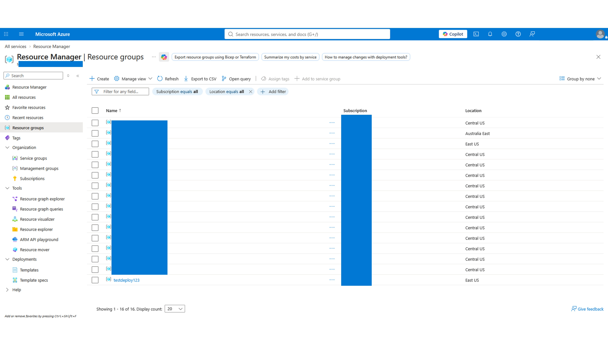
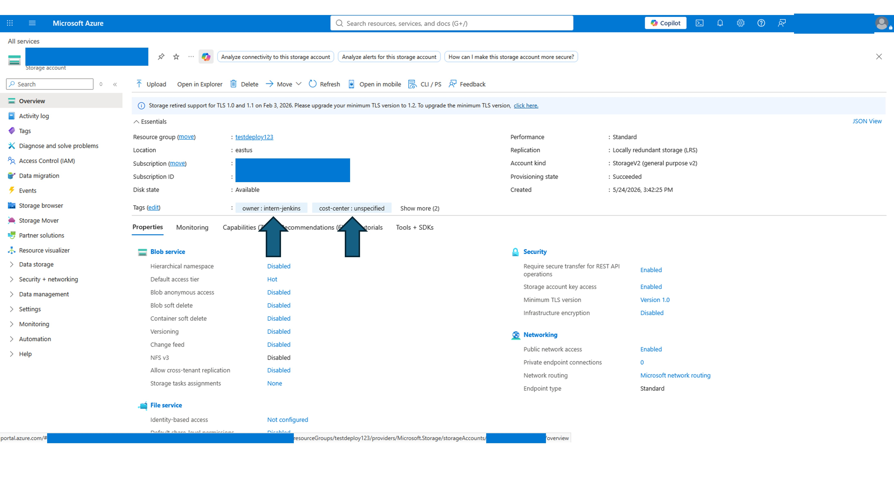
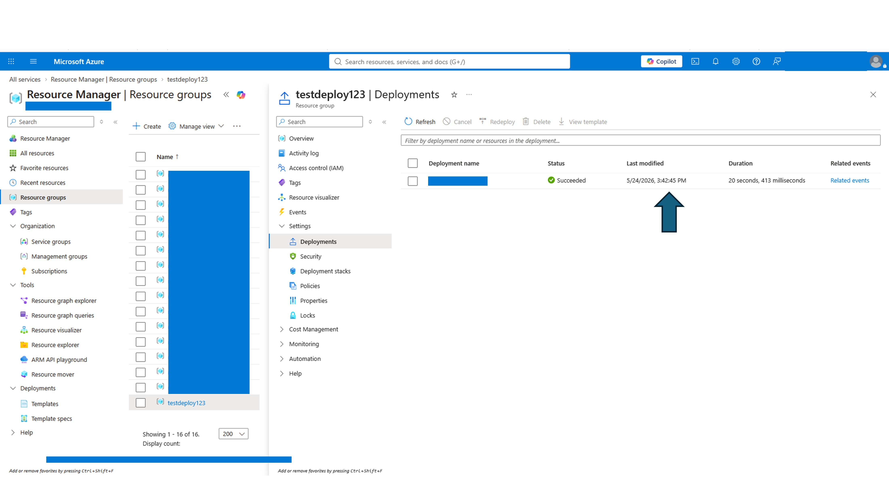
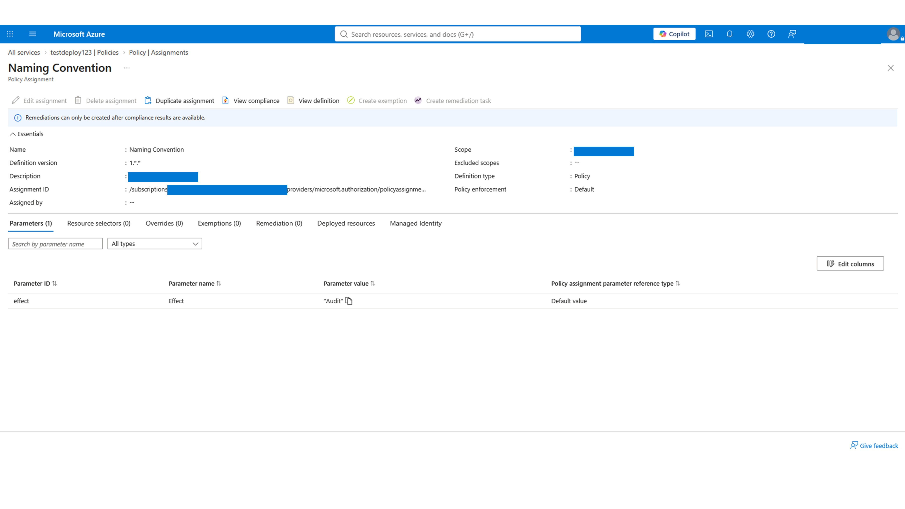

# The Operation Dead Deploy: Investigating a four-stage forensic operation in Azure

## Scenario

Two days ago, a junior intern at Mad Hat Labs was given temporary contributor access to spin up a "test environment" for an experiment that would not be presented to leadership. The intern was not familiar with the company's governance standards and cut several corners. They deployed quickly and left for the weekend.
The scope is to assess the test environment, determine whether governance is properly defined, and document any findings.

## Environment
Azure, resource groups, storage, access level: operative.
Environment: "live multi-user Azure training tenant, Reader access."

## Investigation
**Stage 1**: Locating the test environment
In the first stage, the deployed resource is sought. For that, the Resource groups option in the left blade is selected. By browsing through all the group resources, a resource is found that does not follow the naming convention:
{resource-type}-{workload}-{environment}-{region}-{instance}.

As a second finding, it has been set up in the East US location while most of the other resources are in Central US. The correct location should be evaluated.

**Stage 2**: The payload is inspected.
After inspecting the resource group, there is one storage account linked to it. Also, there is one successful deployment log. Inspecting the storage, the tags are analyzed, revealing ownership, cost center, and lifecycle. The cost center has not been properly assigned.

**Stage 3**: Tracing the deployment.
On the deployment blade, the deployment record shows timestamps to correlate with security alerts and create an incident timeline. It can also reveal who is responsible for each deployment.

**Stage 4**: Policies.
Navigating to the resource group's "Policies" blade, there is an existing policy about naming convention. As it was found, the parameter value was set to "Audit" instead of "Deny." The effect of this is an alert instead of a denied deployment.

## What broke / what surprised me
The importance of properly configured policies is vital to avoid undesired deployments and other issues. Also, proper tagging can help personnel understand a resource's lifecycle, cost center, and ownership in a timely manner. As for the deployment blade, we can get a full picture of the story behind the deployment.

## Findings and recommendations
Policy needs to be fixed and set to "Deny" instead of "Audit" to avoid wrong naming convention in the future.
Setting a proper cost center/location is essential before any deployment.

## What I learned
- Tags do matter. They help us understand all the resources.
- Proper naming is there for a reason. It's easier to identify any resource and its importance if it is properly named.
- A policy set to Audit will fire the alarms but won't stop something from happening, and this could be potentially dangerous.

End report