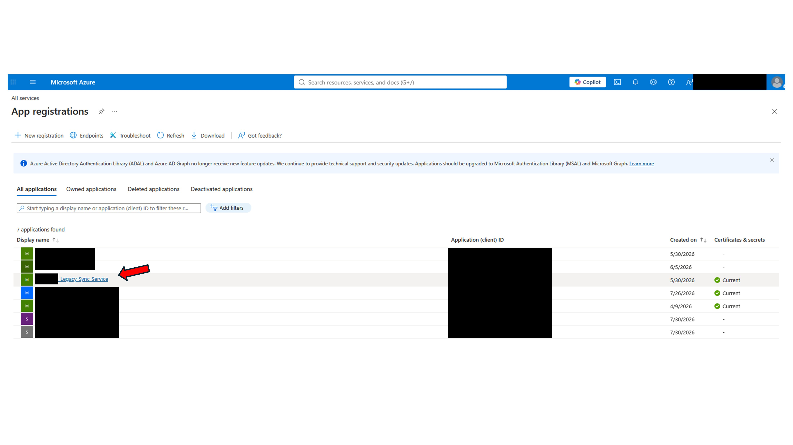
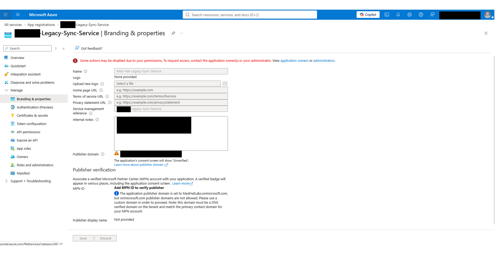
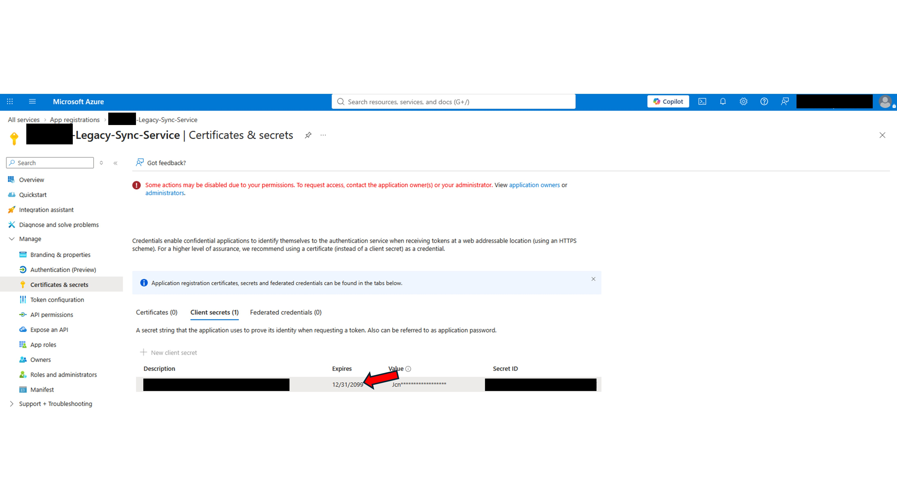
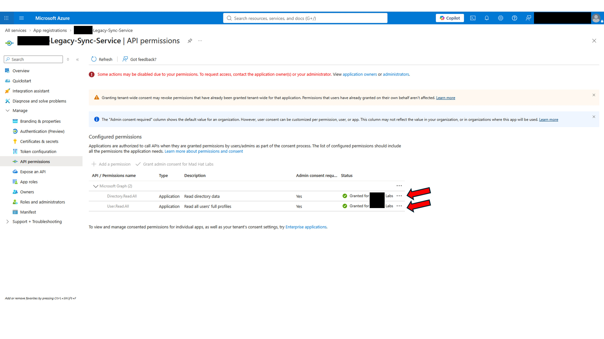
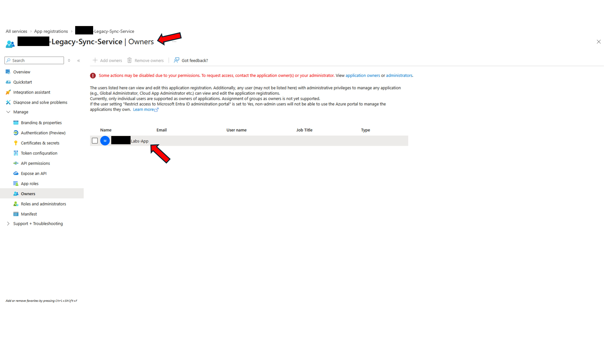
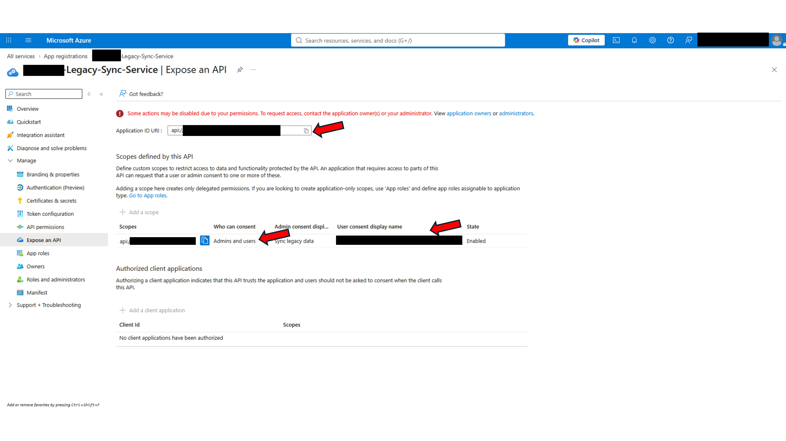
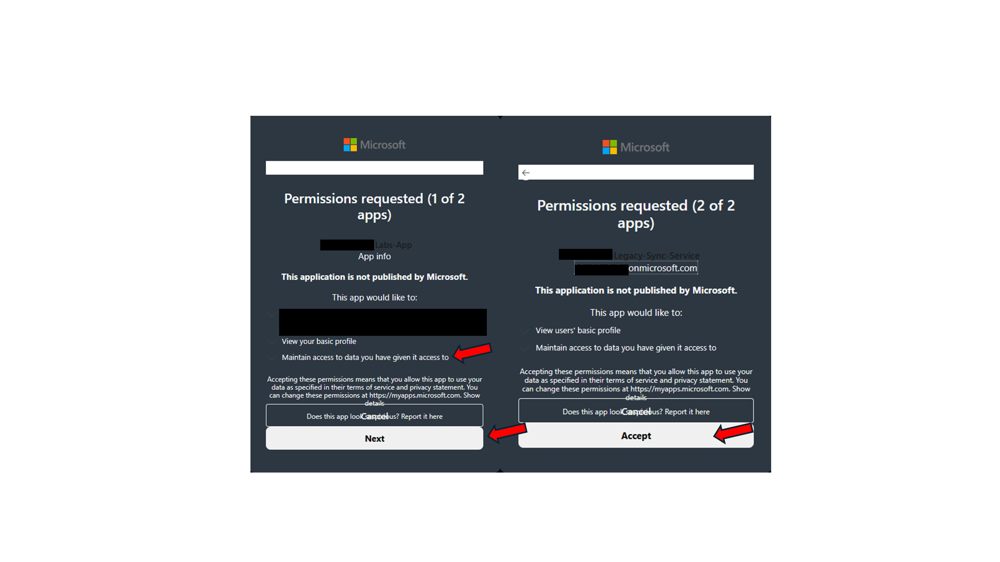

# The Stolen Identity: Reconstructing an OAuth consent-phishing operation

## Scenario
Reconstructed a five-stage OAuth consent-phishing kill chain in a live Azure tenant through forensic analysis of two linked app registrations.

## Environment
**Azure Cloud**
Services/tools: Microsoft Entra ID, app registrations, enterprise applications, API permissions.
Environment: live multi-user Azure training tenant.
Status: Active investigation
Clearance: operative (Reader access)

## Investigation
**Stage I.** The entry
Recreating the scene, the attacker's first move was an employee, phished by a fake login page. They typed their credentials on a spoofed site, including MFA.
Attackers stole the session token with an MFA-satisfied claim, allowing reuse of an MFA-authenticated session, subject to applicable Conditional Access controls.

The incident response team logged the entry method as metadata on the legacy app. The first step is to investigate the internal notes property that the organization uses to track context. As the victim was the owner of the Legacy-Sync-Service, it was possible to add new owners.

**Stage II**: Escalate
The next step would be to investigate what the victim had access to. The attacker might have been able to escalate privileges with permissions on the compromised account.
Under the Certificates & secrets blade, a client secret was found expiring on 12/31/2099. This allowed attackers to authenticate using client credentials as the service principal by using the app’s existing, admin-consented application permissions.

**Stage III**: Pivot
On the Owners blade, a rogue app was found.
If the secret is rotated or eliminated, the attacker's access would expire too. This is why the attackers registered a different app and added it to the owners list of the Legacy-Sync-Service, so they could mint more app secrets.

The rogue app was set as the owner of the legacy app.

**Stage IV**: Persist
Looking for other services compromised in the incident, a persistence mechanism was found in the "Expose an API" blade. Acting as a secure application, other applications can call it. Attackers can use the rogue app credentials to launch a new phishing campaign with the custom scope added. This means other apps can ask for a sync on behalf of a user, which is allowed under Entra policies.

**Stage V**: Loot
The attacker could potentially collect tokens from other users in the tenant. The Expose an API blade shows a custom scope that silently delegates access on behalf of users to the malicious app. This could allow the attacker to act as the user on the legacy app and utilize the legacy app's privileged permissions. This could enable a "confused deputy" attack.

Structure:
https://login.microsoftonline.com/{tenant-id}/oauth2/v2.0/authorize?

client_id={ROGUE-APP-CLIENT-ID}

&response_type=code

&redirect_uri={ATTACKER-TRAP-URL}

&scope=api://{LEGACY-APP-CLIENT-ID}/Legacy.Sync

If a user who has already logged in and likely passed MFA clicks the phishing link, they are show the permission request, if accepted the code is sent to the URI, exchanged for the actual token and a call to the Legacy-Sync-Service. 

## What broke / what surprised me
The most incredible part is that a single compromised account can quickly turn into a much bigger problem, with associated risks such as privilege escalation at the tenant level.
Also, rotating or deleting the app secret will not work if persistence goes undetected. Changing passwords will not revoke the OAuth2PermissionGrant even if MFA is activated.

## Findings and recommendations
| Finding | Evidence | Impact | Recommendation |
| --- | --- | --- | --- |
| Certificates & secrets | Expiration date too high | Active stolen credential | Delete the attacker-added secret and rotate compromised credentials. Configure alerts for new client secrets. |
| Rogue app "*Labs-App" | New app set as owner of Legacy-Sync-Service | Rogue app as owner, capable of creating, editing, and reading | Remove the rogue service principal from the legacy app's Owners list, then disable or delete the malicious app. Audit every app registration's Owners list |
| Expose an API | Legacy-Sync-Service exposed | Acts as a secured backend resource | Delete the custom API scope. Identify and explicitly revoke any malicious 'OAuth2PermissionGrant'. |
| Spoofed application URI & user consent display name | Permission request screen | Active token-stealing infrastructure | Remove the attacker-controlled redirect URI and deceptive consent display text. Configure alerts for new redirect URIs. |
| Default user app registration (preventive recommendation) | Rogue app registration; tenant-wide registration setting not verified | Uncontrolled app creation can introduce unmanaged identities | Disable default user app registration; allow approved users to register applications through controlled permissions. |

## What I learned
- Better controls, such as denying access from unusual IPs, requiring corporate devices, and geography-based restrictions, would improve security.
- MFA certainly blocks most intrusions, but intrusions can still happen. MFA is not enough for stolen pre-auth tokens or without controls like requiring corporate devices or unusual IP access control. 
- IF the attacker started collecting tokens, a victim with different permissions could potentially expand the area of impact. It is also possible that the legacy app exposes information across the entire tenant.

End report.