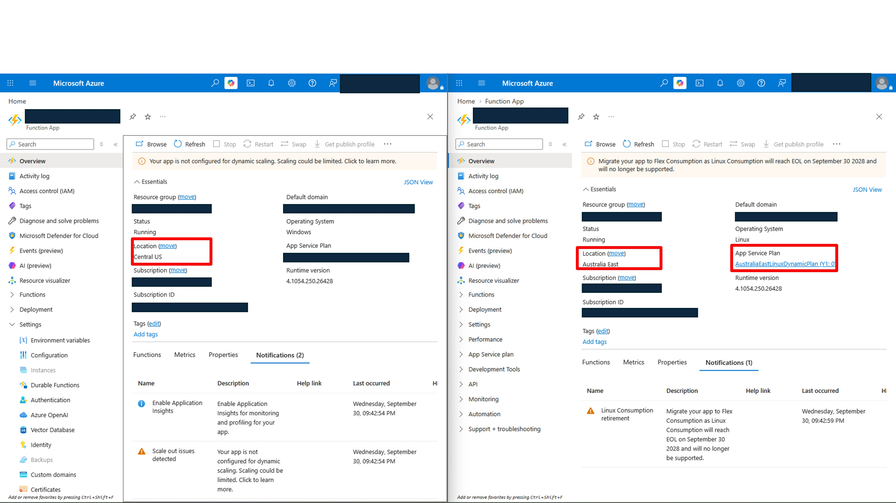
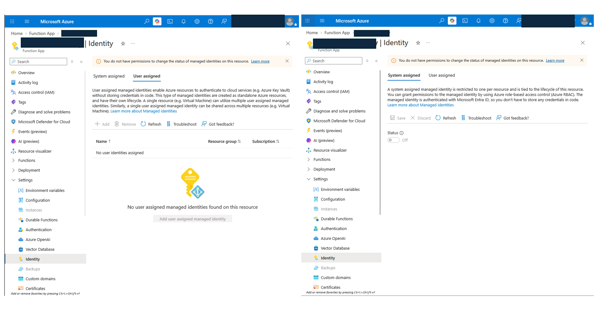
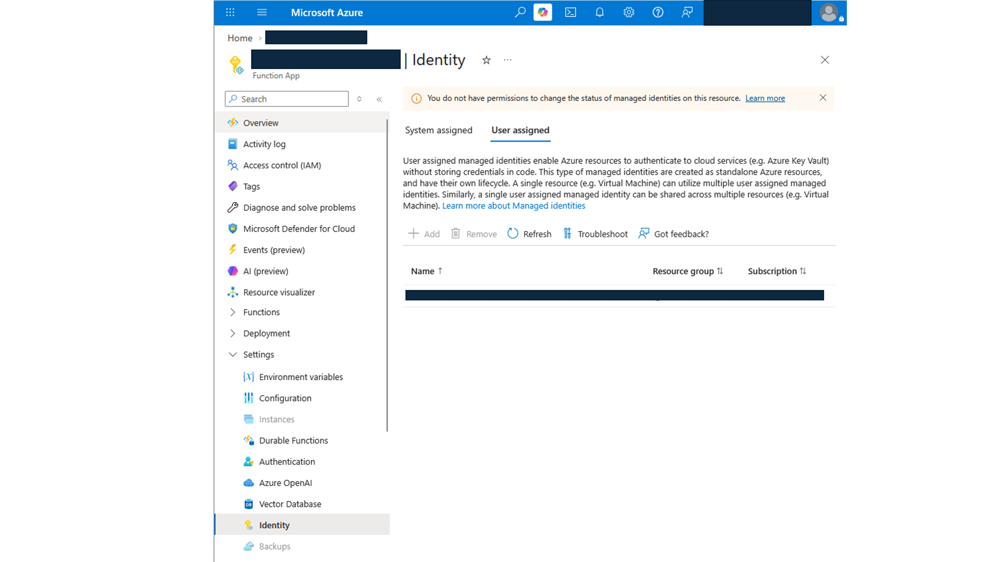
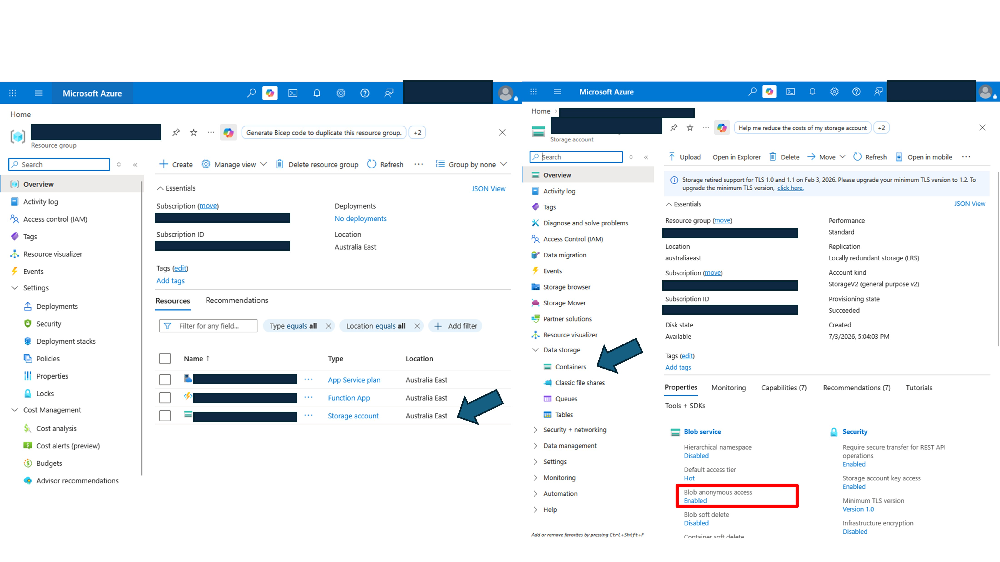
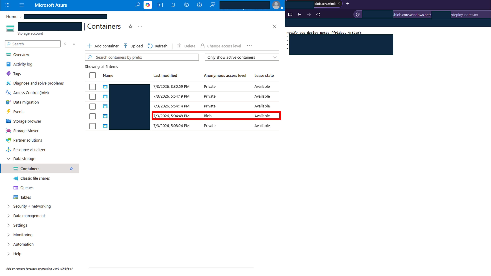
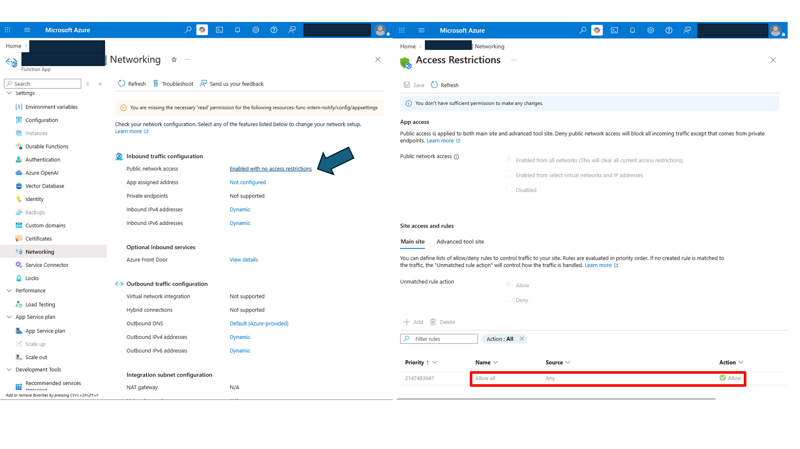
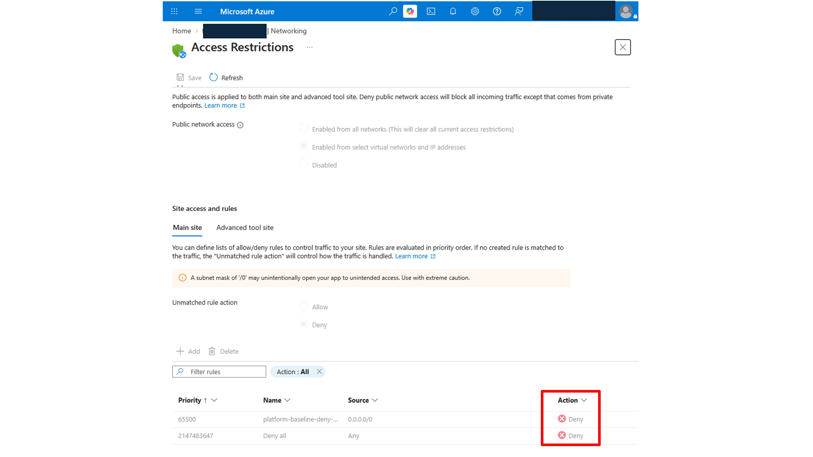

# The Friday Deploy

## Context and scope

An intern deployed a new notification service on Friday at 4:57 p.m. The service is called func-intern-notify, and the service resides in a resource group that has not been reviewed since deployment. It must be reviewed before it ships to production and compared against the production baseline.
 
## Environment

**Azure Cloud**
Ticket: Review func-intern-notify before prod promotion

Services/tools: Microsoft Entra ID, resource groups, IAM, Containers, and networking.

Environment: live multi-user Azure training tenant.

Status: Deployed on Friday by an intern.

Clearance: Operative (Reader access)

## Method

1) Where is the resource?

This report is not intended to be an audit or technical incident response documentation, but rather a documented triage process. Currently, there are no concrete guidelines for supervising the deployment of new resources. However, there are many healthy, ongoing production resources. The chosen method was to compare the new deployment with an existing healthy production service in the shared resource group across five review areas.

Path:  
Where is it? -> Who is it (how does it authenticate)? -> Where does its data go? -> Who can reach it? -> What should be fixed first? (priority fixes)

In this particular case, the resource was deployed over the weekend. The immediate action is to collect information about it.
Locate the function in the resource group and get an overview:

There are some differences between the Function App and the production Function App:

- Geographic difference: Central US vs. Australia East
- Different App Service Plan

It can also be noted that neither has any tags.

Why is it relevant?

a) Latency. A service that crosses region boundaries may experience delays in data ingress and egress as the distance increases.
b) Data ingress in Azure is free, but data egress is not. If the services exchange data across regions, interregional data transfer costs may apply.

2) What identity does it use? How does it authenticate?

In the Identity blade, the system-assigned and user-assigned identities are inspected. No associated identity was found.

For comparison, this is a production Function App.

This could mean there is a different way to authenticate to the services.

3) Where does its data go?

Next, the intern's storage account in the resource group is inspected.

Resource Group > Storage > Containers

There is one container that is different from the others. It contains a blob with a URL that is accessible to anyone inside or outside the organization. A private browser is opened, and the URL is tested. The blob was successfully accessed from a private browser session without an account, token, or sign-in, confirming anonymous public read access.

4) Who can reach it?

Under Settings in the Networking blade, public network access is enabled, with no access restrictions in the inbound settings. On inspection, it is apparent that traffic is allowed from any source without restrictions. Based on its intended purpose as a scheduled-job service, no inbound connectivity requirement was identified.

For comparison, there is a Deny rule set in a different function in the production resource group.

5) The call (what to fix...) 
There were four findings in total: 
- Wrong geography 
- Identity unmanaged 
- A public container 
- Inbound requests enabled with no restrictions. 

| Priority | Finding | Recommendation |
| --- | --- | --- |
|01 - CRITICAL|Public Container Access|Contain the exposure immediately. Treat the publicly accessible data as an active exposure and determine what information was accessible and for how long.|
|02 - HIGH | Inbound request enabled| A Deny rule must be put in place. The risk of accepting inbound requests without restrictions could lead to further exposure of private information. |
|03 - MEDIUM | No managed Identity | No managed identity was configured. Static credentials or secrets may be used instead, which is less safe than using managed identities. |
|04 - MEDIUM |Unexpected region|The expected region was Central US. Associated latency or unwanted cost increases are possible.|

## What broke / what surprised me
A small mistake can cost money, expose restricted information, or create other risks.

## What I learned
EXPOSURE BEATS HYGIENE. ACTIVE BEATS POTENTIAL. Prioritization should be driven by evidence, exploitability, and business impact.
Security professionals must have a strong sense of prioritization and understand the importance of security risks.

End report.